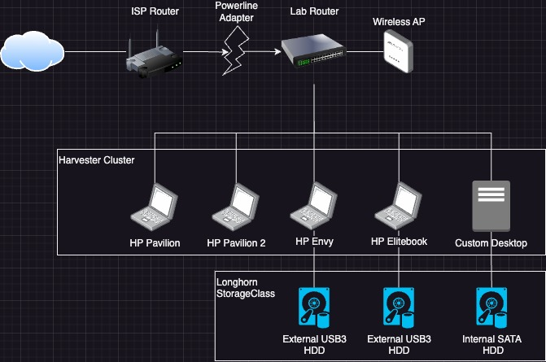

# Home Lab
My home lab is akin to Frankenstein's monster (Fining's monster?). The hardware ranges in manufacture date from 2012 to 2022. A decade of compute working together!

My current setup is 4 laptops and a custom-built desktop all forming a [harvester](https://docs.harvesterhci.io/v1.2) cluster for virtualization.

HP Pavilion
- Intel i7 CPU
- 16GB RAM
- 1TB HDD
- A 100Mb ethernet NIC! I didn't know they still made them. Ask me how I found out it's only 100Mb.

HP Envy
- AMD ? CPU
- 8GB RAM
- 500GB HDD
- 8TB HDD (External USB)

HP Elitebook 8570w
- 3rd Generation Intel i7
- 32GB RAM
- 256GB SSD
- 8TB HDD (External USB)

Custom Desktop
- AMD Ryzen 5 5600G
- 32GB RAM
- 500GB NVMe
- 8TB HDD (Internal SATA)

Monster, indeed. The desktop was a $430 build (without the 8TB HDD). The 8TB HDDs are used (gasp!) enterprise HDDs from Amazon for ~$80 each, which was a steal. They've been rock solid - but they were so loud I had to move my lab behind a closed door in a closet.

The powerline adapter negatively affects network performance when downloading from the internet (I'd probably get faster speeds using the WiFi in the laptops, that severe), but it's been very stable. It also allows for much more flexibility in where I can put the servers and router without running an ethernet cord across my apartment.

### Social
Let's connect on LinkedIn!

[ LinkedIn](https://www.linkedin.com/in/james-fining/)
&nbsp;
